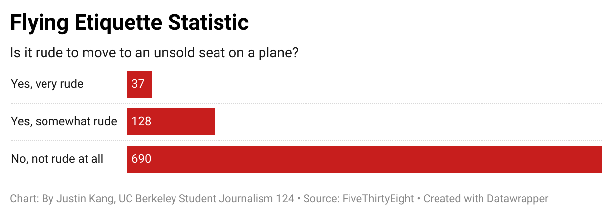

# Flying Etiquette Data

I explored the raw data from the Flying Etiquette CSV offered by FiveThirtyEight. [FiveThirtyEight Github] (https://github.com/fivethirtyeight/data/tree/master/flying-etiquette-surveyLinks to an external site.) 

I created this visualization with Data Wrapper through pulling data from the Flying Etiquette CSV and making a pivot table to extract insights. This table was what was analyized:

(Copy of Flying etiquette - Sheet3.pdf)

I decided to analyze this aspect of flying etiquette because I personally believe moving to a unsold seat is not rude at all and smart if it's empty instead of sitting in a uncomfortable middle seat. However, since that is what I personally I believe, I wanted to also see if the data also matched with this assumtion. 
